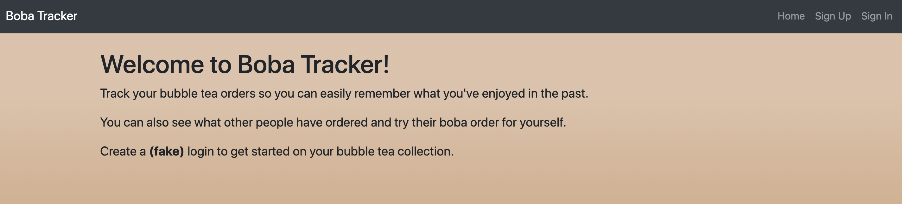
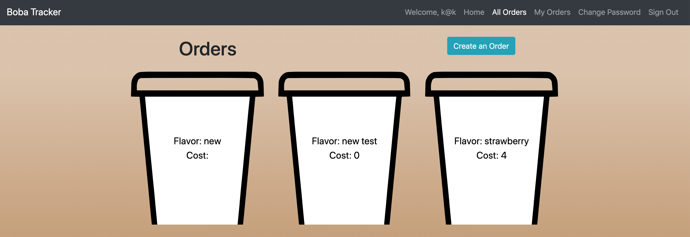

# Boba Tracker
Keep track of your bubble tea purchases so you can remember what you liked and see what others have ordered.

[Front-end Client](https://kimdolion.github.io/boba-tracker-client/#/)

[Front-end Repo](https://github.com/kimdolion/boba-tracker-client)

[Back-end Client](https://limitless-everglades-63033.herokuapp.com/)

[Black-end Repo](https://github.com/kimdolion/boba-tracker-backend)

## Technologies Used
React, React Boostrap, Axios, MongoDB, Express, HTML, CSS, JS

**User** has many **Orders**

  <table style="display:inline">
  <th colspan="2" style="text-align:center">Orders</th>
  <th colspan="2" style="text-align:center">User</th>
  <tr>
  <td>_id</td>
  <td>MongoDB generated</td>
  <td>_id</td>
  <td>MongoDB generated</td>
  </tr>
  <tr>
  <td>flavor</td>
  <td>string</td>
  <td>email</td>
  <td>string</td>
  </tr>
  <tr>
  <td>datePurchased</td>
  <td>date</td>
  <td>hashedPassword</td>
  <td>string</td>
  </tr>
  <tr>
  <td>location</td>
  <td>string</td>
  <td>token</td>
  <td>string</td>
  </tr>
  <tr>
  <td>cost</td>
  <td>number</td>
  <td>timestamps</td>
  <td>datetime</td>
  </tr>
  <tr>
  <td>color</td>
  <td>string</td>
  <td></td>
  <td></td>
  </tr>
  <tr>
  <td>owner</td>
  <td>ref to user</td>
  <td></td>
  <td></td>
  </tr>
  </table>

  #### Order actions currently supported:
  - Create orders
  - (Read) See
    - All orders
    - All orders by owner
    - Show Order by id
  - Edit your order
  - Delete your order

##### End Point Testing

<ul style="list-style-type:none;">
  <li>get -> #index, #show</li>
  <li>post -> #create</li>
  <li>patch -> #update</li>
  <li>delete -> #destroy</li>
</ul>

## Resource Routes
`user routes`:
  - `/sign-up` - POST for sign up credentials
  - `/sign-in` - POST for sign in credentials
  - `/users` - GET for list of users
  - `/change-password` - PATCH for updating credentials
  - `/sign-out` - DELETE for sign out

`order routes`:
  - `/orders` - GET for index of orders
  - `/orders/:id` - GET for individual order (not used, but can be)
  - `/orders` - POST for order creation (applies ownership)
  - `/orders/:id` - PATCH for editting order (requires ownership)
  - `/orders/:id` - DELETE for deleting order (requires ownership)

## Development Process
Planning the project
I honestly started planning this out as soon as we were done with our tic tac toe game.

I love bubble tea also known as boba, which is a reference to the often ordered tapioca pearls that sit in the bottom of the cup.
That being said, I don't always have the best memory of what/where I have ordered this wonderful drink. It's especially frustrating when I can't easily get a hold of my friends who have gone to various shops and ordered any number of drinks.

I wanted to track what I ordered as well as see what my friends might be fans of so I could order it for myself.

## Problem Solving
### Modal
I wasn't sure how modals interact with React. I was thankful for the React Bootstrap documentation so I could grab some code and play with it in the app.

Once I got a working modal filled with dummy data, I played around with making it display the forms I had created as separate links. I tried to make the modal pull in the form but I hit an issue with it not pulling in the user as well. As it turns out with help from peers and instructors, I wasn't passing the information right for it.

### Ownership
I wanted to make sure that users could only update and delete resources that they were the owner of. I used my backend to help return the owner in the Get requests and based on the owner data, I would then compare that to the currently signed in user on the front end and put in a conditional to check this relationship and display buttons based on that condition.

## Unsolved Problems
None so far?

## Wireframes and User Stories

[User Stories](https://docs.google.com/document/d/1rU0EMt1qlRVzYi5IN6PDTBv9FH-f241SB1buLiKU5VY/edit?usp=sharing)

[Wireframes](https://docs.google.com/document/d/1Bmr5gQ1BCXurel8O9UvznKwcHkwt-F_cnnR5uouSSXA/edit?usp=sharing)

[ERD](https://docs.google.com/document/d/1KAxKF9fMoZRf_MedIocuvrfn7yVN1JOpxzY0Z7Bnkl0/edit?usp=sharing)

## Stretch Goals
I have a number of stretch goals I'd love to implement in future iterations.

- Connect a map that lets users attach that to an order.
  - The map renders the location to be used in a map app so others can go there.
  - Would also like to have some amount of validation that it is in fact a bubble tea store
- Add a rating system to individual orders only controlled by owners
- Calculate how much spent on bubble tea: drink vs toppings?

## Additional Resources
